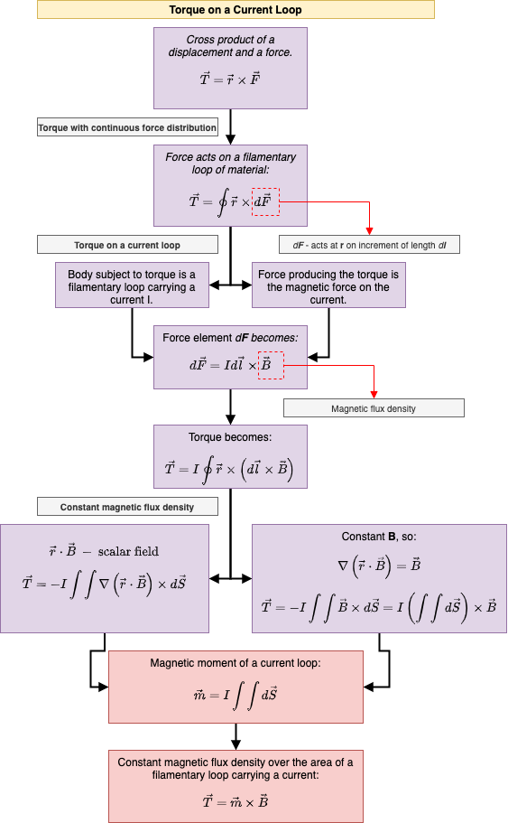

# Physics
## Code Collection 💻 📦

A collection of Physics Concepts applied to different numerical implementations using the Python programming language.

## Workflow ⚙️

Each implementation represents a certain physics topic (e.g., nuclear physics, plasma physics, laser physics and so on) that is organized in its own directory. For every implementation, there are the following folders:

* `code`: stores the actual code with the implementation itself.
* `resources`: a place used for storing documents with the theory used for the development process.

## Content 🗃

A table with all the implementations that were developed throughout this project can be seen [here](content.md).

**Example:** For the sub-project regarding the *Torque on a current loop*, there is the `code/` folder where all codebase is written, while `resources` directory contains some useful resources regarding the actual topic. Also, additional diagrams (that were developed based on some resource notes) are created. Example can be seen below, where a diagram for the *Torque* subject is depicted.

